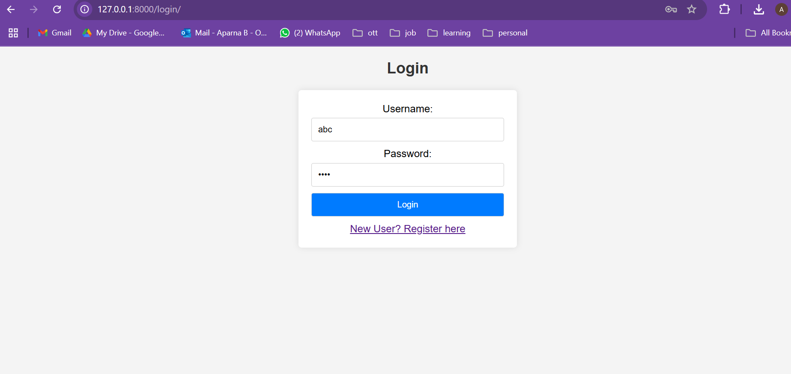
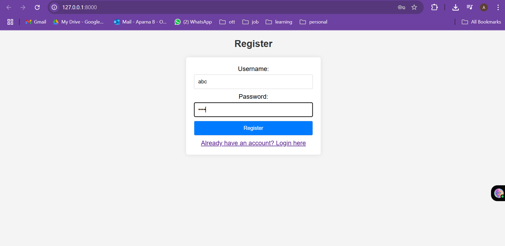
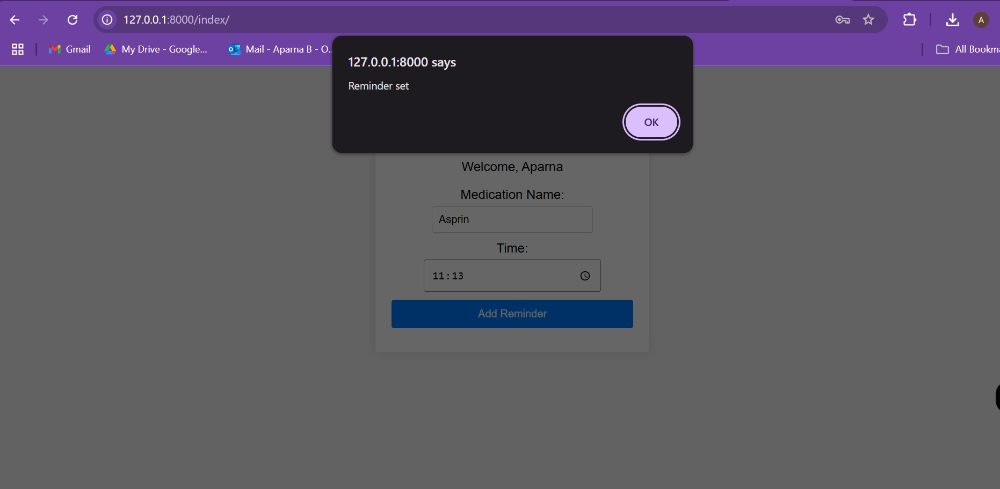
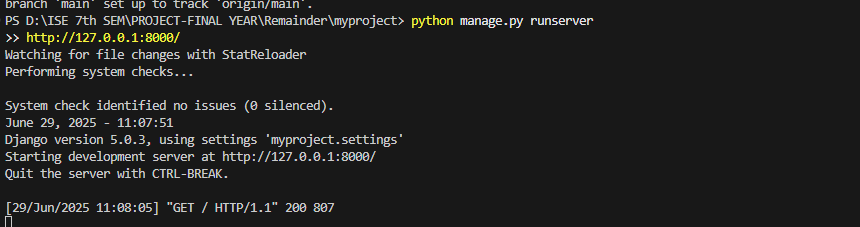

# 💊 Medication Reminder Web App with Voice Notification

This Django-based project helps users **set medication reminders** using a web interface and notifies them using **voice alerts** at scheduled times. It combines **Django**, **Python scheduling**, **speech recognition**, and **text-to-speech** to offer a smart reminder system.

---

## 🚀 Features

- Add medicine name and time via web interface
- Scheduled voice reminders using `pyttsx3`
- Handles medicine acknowledgment via microphone input (Google Speech API)
- Tracks which medicines are already taken
- Integrated with Django's User system

---

## 🛠️ Technologies Used

- **Django** (Python Web Framework)
- **SQLite** (default Django DB)
- `schedule` for task scheduling
- `pyttsx3` for text-to-speech
- `speech_recognition` for voice input
- `argparse`, `datetime`, `os`, etc.

---

## ⚙️ How to Run the Project

### 🔧 1. Clone the Repository

```bash
git clone https://github.com/aparnab-02/medication_remainder.git
cd medication_remainder
```

---

###  2. How to run the application:
python manage.py runserver
>> http://127.0.0.1:8000/


Then open the website in your browser:

```
http://127.0.0.1:8000/
```

You can now register/login and input medication name + time.  
✅ You will receive **voice alerts** when it's time to take your medication.

---

### ▶️ 4. Start the Reminder Script

Open a **second terminal** (while the Django server is still running):

```bash
python main.py --username your_django_username
```

This script will:
- Fetch medications for the logged-in user
- Announce reminders using voice
- Ask via mic if the user took the medicine
- Mark it as taken if confirmed

---

## 🖼️ Screenshots

### 🔐 Login Page


---

### 📝 Register Page


---

### 💊 Add Medication Reminder


---

### 📖 How to Run Instructions


---

## 🙋‍♀️ Author

**Aparna Bapuram**  
🔗 [GitHub Profile](https://github.com/aparnab-02)

---

## 📄 License

This project is licensed under the [MIT License](LICENSE).
